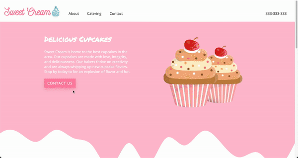

# Mock Cupcake Shop Landing Page

This static landing page was built just to practice writing Sass. I focused purely on getting comfortable with scss, nesting, and variables. After my first taste of scss I already don't think I'll be going back to just writing css. Can't wait to dive deeper and learn more about scss.

Even with small projects like this I enjoy creating a mockup or wireframe and doing my best to imitate the design. The mockup for this project can viewed [here](https://www.canva.com/design/DAEoJ4PyRI0/emNCZOLokPqE1sy7Wq1UCg/view?utm_content=DAEoJ4PyRI0&utm_campaign=designshare&utm_medium=link&utm_source=publishsharelink). 

